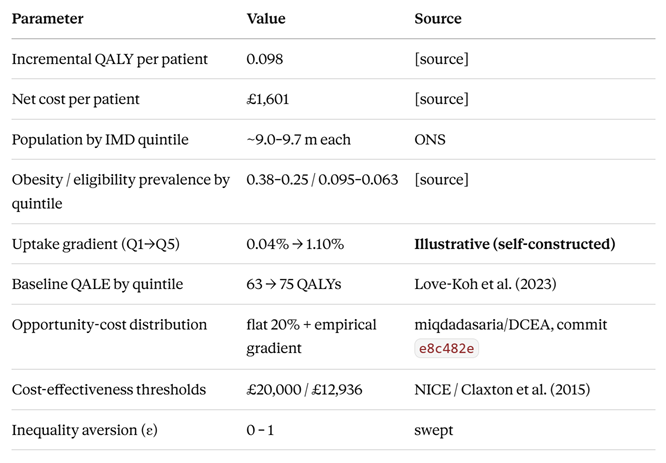

# Beyond the ICER: A Distributional Cost-Effectiveness Analysis of Semaglutide in England
Does a cost-effective obesity drug reduce or widen health inequality? A full distributional cost-effectiveness analysis (DCEA) built in Excel following Dr Asaria's experimental framework.

Methods: DCEA · Atkinson equally-distributed equivalent (EDE) · one-way sensitivity analysis
Tools: Microsoft Excel
Socioeconomic variable: Index of Multiple Deprivation (IMD) quintiles (England 20222 - 2024)

Key finding: Semaglutide is cost-effective overall (ICER £16,337) but regressive — under a pro-affluent uptake gradient, the three most deprived quintiles experience net health loss while the two richest gain. The verdict reverses entirely under an empirical opportunity-cost threshold.

Abstract

<!-- WRITE LAST. 4–6 sentences. Fill in the brackets. Keep it tight. -->
This project applies distributional cost-effectiveness analysis (DCEA) to semaglutide (2.4 mg) for obesity in England, extending standard cost-effectiveness analysis (CEA) to ask not only whether the intervention is cost-effective but how its health effects are distributed across socioeconomic groups. Net health benefit is estimated by IMD quintile, incorporating the socioeconomic distribution of health opportunity costs, and collapsed into an equity-adjusted value using the Atkinson equally-distributed equivalent. [ONE SENTENCE: your headline result — cost-effective overall, regressive by quintile.] [ONE SENTENCE: what drives it — uptake gradient + regressive displacement.] [ONE SENTENCE: sensitivity — robust to distribution, reverses at the empirical threshold.] [ONE SENTENCE: implication.]

1. Introduction

<!-- Two short paragraphs. -->
The problem. <!-- CEA maximises total health but is blind to its distribution. NICE is actively exploring DCEA. Obesity is deprivation-linked, GLP-1 drugs are costly, and real-world uptake skews affluent — making semaglutide a natural equity case study. Write 3–4 sentences in your voice. -->

This project. <!-- What you built and why. e.g. "This repository presents a complete aggregate DCEA built from public and illustrative data, replicating the Asaria framework and extending it with a full one-way sensitivity analysis across cost, opportunity-cost distribution, and threshold." State what the reader will find. -->

2. Background

<!-- One short paragraph + the anchor list. Do NOT write a full literature review. -->
Distributional cost-effectiveness analysis quantifies the trade-off between maximising total health and reducing health inequality. This project builds directly on the following:

Cookson, Griffin, Norheim & Culyer — the DCEA conceptual framework: net health benefit distributed across equity-relevant subgroups, combined with a social welfare function.
Asaria, Griffin & Cookson (2016), Medical Decision Making — the aggregate DCEA tutorial whose modular structure this project follows.
Love-Koh et al. (2020, 2023) — quality-adjusted life expectancy (QALE) by IMD quintile, and the socioeconomic distribution of health opportunity costs.
Claxton et al. (2015) — the empirical NHS cost-effectiveness threshold (~£12,936/QALY), used here as an alternative to NICE's £20,000 convention.

