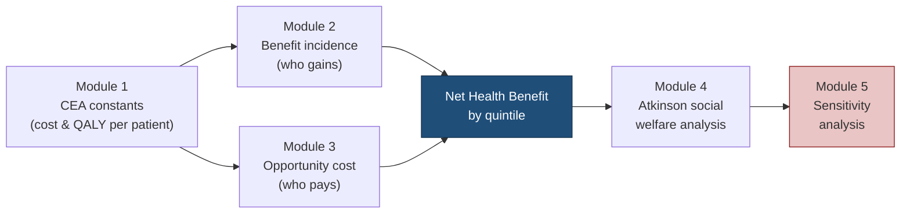

# Beyond the ICER: A Distributional Cost-Effectiveness Analysis of Semaglutide in England
Does a cost-effective obesity drug reduce or widen health inequality? A full distributional cost-effectiveness analysis (DCEA) built in Excel following Dr Asaria's experimental framework.

Methods: DCEA · Atkinson equally-distributed equivalent (EDE) · one-way sensitivity analysis
Tools: Microsoft Excel
Equity variable: Index of Multiple Deprivation (IMD) quintiles, England (2022–2024 data)

**Why this project?** 
Standard cost-effectiveness analysis asks whether a drug is worth funding. It says nothing about who gets the health and who pays for it. I built a distributional cost-effectiveness analysis (DCEA) to answer that second question for semaglutide 2.4 mg (Wegovy) in England. To ask whether incorporating health inequality in the model changes the way we assess an intervention and identify how its health effects are distributed across socioeconomic groups.

**So why Semaglutide?**
I chose Semaglutide (2.4 mg) to apply my newfound knowledge from Dr Miqdad Asaria's short interactive exercise in DCEA using fictional data "Slimstatin for Obesity. I used his framework to create a complex, empirical evaluation using real-world data derived across multiple distinct clinical and socioeconomic sources. For verification purposes and to eliminate confirmation bias during model design, this analysis was developed independently prior to reviewing existing literature on the subject, establishing a blinded baseline to later compare against external evaluations (such as the ISPOR Semaglutide DCEA case study).

Before I explain the framework and results, I would like to quickly lay out the parameter definitions and abbreviations used throughout the project below.

<strong>ICER</strong> — Incremental Cost-Effectiveness Ratio

The additional cost per additional QALY gained, comparing the new intervention to standard care.

<strong>QALY</strong> — Quality-Adjusted Life Year

A metric where 1 unit equals one year of perfect health for a patient.

<strong>CEA</strong> — Cost-Effectiveness Analysis

The standard way to check if a new drug gives enough health benefit to justify its price tag.

<strong>QALE</strong> — Quality-Adjusted Life Expectancy

The total number of healthy, quality years a person can expect to live from birth.

<strong>NHB</strong> — Net Health Benefit

The final health gain left over after you subtract the health lost from the budget to pay for it.

<strong>IMD</strong> — Index of Multiple Deprivation

England's official small-area deprivation ranking; Q1 = most deprived.

<strong>EDE</strong> — Equally-Distributed Equivalent

Total health discounted for how unequally it is spread.

<strong>ε</strong> — Inequality aversion parameter

How much total health society will sacrifice for a fairer distribution.

<strong>WTP</strong> — Willingness-to-Pay threshold

The £/QALY benchmark used to judge value (NICE convention: £20,000).

<strong>ERG</strong> — Evidence Review Group

The independent academic group that critiques a company's NICE submission.

<strong>TA875</strong> — NICE Technology Appraisal 875/summary>
The NICE appraisal of semaglutide 2.4 mg for weight management.

**Need falls with affluence | access rises with it**

Figure 1. The core tension in one picture: obesity prevalence is highest in the most deprived quintiles, but treatment uptake runs the other way.

## How the model works

I broke down the data extraction and modelling into 5 modules.

**Module 1: Cost-Effectiveness Analysis (CEA) Constants & Parameter Derivation**

I anchored the baseline evaluation in NICE Technology Appraisal 875 (TA875). Because the UK-specific utility data for semaglutide 2.4 mg is commercially confidential, I adapted an incremental QALY proxy of 0.098 per patient from a methodologically aligned Core Obesity Model, over the same 40-year discounted horizon.

Pairing that QALY gain with the independent ERG base-case ICER of £16,337/QALY lets me algebraically isolate a lifetime net incremental cost of £1,601 per patient.

I then benchmarked this against two thresholds: the conventional NICE willingness-to-pay threshold (£20,000/QALY) and Claxton's empirical estimate of the NHS's marginal opportunity cost (£12,936/QALY). This sets up the central tension of the whole project: the same patient generates a positive per-person NHB (+0.018 QALYs) under NICE convention, but a net health loss (−0.026 QALYs) once you count what the NHS actually displaces to pay for it.

**Table 1 : Core model parameters**

| Parameter | Value | Source |
|---|---:|---|
| Incremental QALY per patient | 0.098 | Core Obesity Model (40-yr discounted horizon) |
| ERG base-case ICER | £16,337/QALY | NICE TA875 ERG report |
| Net incremental cost per patient | £1,601 | Derived (0.098 × £16,337) |
| NICE WTP threshold | £20,000/QALY | NICE reference case |
| Empirical opportunity cost threshold | £12,936/QALY | Claxton et al. |
| Per-patient NHB at £20,000 | +0.018 QALYs | Derived |
| Per-patient NHB at £12,936 | −0.026 QALYs | Derived |

---

**Module 2 - Who gains?: Benefit Incidence**

To map the social distribution of health gains, a disaggregated benefit incidence framework was constructed by combining national demographic profiles with localized clinical and commissioned data. Population denominators per income quintile were derived by isolating adults aged 16 and over from the 2020 ONS mid-year deprivation decile estimates and applying their relative proportions to a headline adult population total of 47,220,600. 

Clinical need was quantified using age-standardised obesity prevalence (BMI ≥30) from the Health Survey for England 2024, scaled by 25% following Finer et al. (2025) to isolate the BMI ≥35 specialist-eligible population. Similarly, uptake was derived from regional Tier 3 treatment rates across all 42 English ICBs (Finer et al., Clinical Obesity, 2025), mapped to IMD quintiles and ranging from 0.04% (North East and Yorkshire) to 1.10% in the least deprived (South East).

Multiplying population × eligibility × uptake isolates a treated national cohort of 15,240 patients — concentrated heavily in the least deprived quintiles. Applying the 0.098 QALY multiplier gives gross health gains per quintile.

**Module 3 - Who pays: opportunity cost distribution**

Funding the drug displaces other NHS care, and that displaced health also has a social distribution. I modelled it two ways: a uniform reference case (20% of displacement per quintile, the conventional NICE assumption & Dr Asaria's base case example) and an empirical deprivation-weighted case (27% in Q1 falling to 13% in Q5, adapted from the University of York CHE Prototype Equity Tool), reflecting that poorer groups use more NHS care and so lose more when budgets tighten.

Subtracting each quintile's displaced QALYs from its gross gains yields Net Health Benefit per quintile, the central metric of the DCEA. The result is stark: the most deprived quintiles carry a persistent negative NHB. The intervention doesn't just fail to help them; it makes them net worse off by displacing services they rely on.

**Table 2 — Net Health Benefit by quintile (£20,000 threshold, base case)**

| IMD quintile | Treated patients | Gross QALYs | Displaced QALYs | Net Health Benefit |
|---|---:|---:|---:|---:|
| Q1 (most deprived) | 341 | 33.5 | 244.0 | **−210.6** |
| Q2 | 1,598 | 156.6 | 244.0 | −87.4 |
| Q3 | 2,402 | 235.4 | 244.0 | −8.6 |
| Q4 | 4,522 | 443.2 | 244.0 | +199.2 |
| Q5 (least deprived) | 6,377 | 624.9 | 244.0 | **+380.9** |
| **Total** | **15,240** | **1,493.7** | **1,220.0** | **+273.6** |

*Displaced QALYs follow the NICE reference-case assumption of uniform displacement (20% per quintile). Row values are rounded; totals are computed from unrounded figures.*

Figure 2. The gains flow to the least deprived; the losses land on the most deprived.

**Module 4: DCEA & Atkinson social welfare analysis**

To ask how much a decision-maker who cares about fairness should discount these results, I implemented an Atkinson social welfare function over baseline quality-adjusted life expectancy (QALE) by quintile. I kept the three-part QALE spine from the Asaria template but fixed a scale mismatch, cleanly reconciling per-capita life expectancy with population-level total net benefits, and changed the net benefit calculation to explicitly subtract the distributed opportunity costs from Module 3 rather than omitting them.

The headline insight: a single drug moves a nation's lifetime per-capita health distribution by almost nothing; the per-person QALE shift is on the order of 10⁻⁵, so baseline and semaglutide EDE values differ only in the fifth decimal place. The verdict stays with semaglutide through mild-to-moderate inequality aversion (ε ≤ 3), but under a strong equity commitment (ε ≥ 5) the welfare penalty for compounding an unequal distribution outweighs the microscopic mean gain, and the baseline becomes preferred. The sharper equity story, though, lives in the disaggregated quintile rows, which show the poorest groups structurally absorbing net harm while the wealthiest capture the gains.

**Table 3 — Atkinson EDE (QALE, years) by inequality aversion (ε)**

| ε | Interpretation | Baseline EDE | Semaglutide EDE | Preferred strategy |
|---:|---|---:|---:|---|
| 0.0 | Pure efficiency (standard CEA) | 69.845745 | 69.845751 | Semaglutide |
| 0.5 | Mild aversion | 69.784581 | 69.784586 | Semaglutide |
| 1.0 | Moderate aversion | 69.722833 | 69.722837 | Semaglutide |
| 2.0 | Substantial aversion | 69.597688 | 69.597691 | Semaglutide |
| 3.0 | Strong aversion | 69.470536 | 69.470538 | Semaglutide |
| 5.0 | Very strong aversion | 69.211244 | 69.211243 | **Baseline** |
| 10.0 | Extreme aversion | 68.548174 | 68.548167 | **Baseline** |

*Baseline QALE at birth spans 63 (Q1) to 75 (Q5), a 12-year healthy-life gap (Love-Koh et al.). EDE values are shown to six decimals because a single drug shifts per-person lifetime QALE by only ~10⁻⁵; the decision flips between ε = 3 and ε = 5, where the welfare penalty for the regressive distribution overtakes the tiny mean gain.*

**Module 5: Sensitivity Analysis Breakdown | Can anything reverse the regressive pattern?**

Each panel isolates a core assumption of the framework to test whether alternative policy settings or pricing shifts could reverse the regressive nature of the intervention.

**SA1 - Intervention Acquisition Cost (Drug Cost)**
The Mechanism: This panel varies the annual cost of Semaglutide from an ultra-low £1,400 up to £20,000.
The Finding: Lowering the price does not fix the equity gap; the optimal decision remains firmly with the baseline across all evaluated price points. Because of the regressive uptake gradient, the poorest population (Q1) simply does not get sufficient access to the drug. Consequently, even at £1,400/year, the health displaced from Q1's local health budget to fund the wider program outweighs their clinical gains, leaving them at a net deficit ($-179.92$ QALYs).

**SA2 - Health Opportunity Cost Distribution (Displacement Burden)**
The Mechanism: This panel moves away from the uniform reference case ($20\%$ displacement per quintile) to evaluate four distinct ways the NHS budget might absorb the intervention's cost, ranging from pro-poor to pro-rich displacement distributions.
The Finding: Altering how service cuts are distributed across the NHS fails to protect the vulnerable. Even under a highly optimistic "Concentrated Richest" scenario—where the wealthiest areas bear $50\%$ of the budget displacement and the poorest bear only $3\%$—Q1 still incurs a net health loss ($-36.60$ QALYs). The systemic access barriers are so entrenched that Q1 loses under every conceivable displacement architecture.

**SA3 - Opportunity Cost Threshold**
The Mechanism: This panel contrasts the optimistic, policy-driven NICE reimbursement threshold (£20,000) against the realistic, empirical NHS marginal cost per QALY (£12,936).
The Finding: When evaluated against what the NHS actually spends to generate health historically, the intervention suffers a massive systemic sign-flip. Total population Net Health Benefit collapses from a positive $+273.58$ QALYs down to a net societal deficit of $-392.66$ QALYs. This intensification of opportunity cost deepens the health deficit for the poor, accelerating Q1's net losses to an extreme $-343.80$ QALYs.

**Results & Discussion:** On a pure efficiency basis ($\alpha = 0.00$), semaglutide expands overall population health, yielding a positive net benefit of $+273.57$ QALYs. However, this gain is entirely driven by the wealthiest quintiles (Q4 and Q5), while the poorest quintiles (Q1–Q3) experience a net health loss. This regressive result is driven by a steep uptake gradient (ranging from $0.04\%$ in Q1 to $1.10\%$ in Q5) and a regressive opportunity cost structure where NHS health displacement falls disproportionately on poorer groups. Because individual per-capita losses among the poor are small relative to baseline life expectancy, a decision-maker with mild-to-moderate inequality aversion ($\alpha \le 3.00$) would still prefer semaglutide. However, under a stronger commitment to equity ($\alpha \ge 5.00$), the social welfare penalty for compounding inequality outweighs the aggregate gains, making the baseline non-intervention strategy preferred. Crucially, the drug's overall value is highly threshold-dependent: it is net-beneficial at the conventional £20,000 NICE threshold ($+273.6$ QALYs) but net-harmful at the £12,936 empirical threshold ($-392.7$ QALYs). 

**Conclusion:** These findings demonstrate that standard cost-effectiveness and equity metrics can point in opposite directions. An intervention that satisfies standard efficiency criteria may still widen health inequalities, underscoring that how a treatment is implemented and accessed across socioeconomic gradients matters as much as whether it is funded.

**DCEA parameter glossary**
I have defined the key variables by module

**1 · Core model & population**
IMD quintile: Five population segments by Index of Multiple Deprivation, from Q1 (poorest) to Q5 (richest).
Baseline QALE:	Quality-adjusted life expectancy for a typical person in each quintile, before the drug.
Total net benefit (+273.6 QALYs):	Sum of net benefit across all quintiles at the £20,000 threshold — gains after subtracting displaced health.

**2 · Intervention (semaglutide 2.4 mg)**
Uptake gradient (0.04% → 1.10%):	Rate at which patients access the drug, rising from the poorest to the richest quintile.
Gross health gain:	Total QALYs generated by semaglutide for patients who access it, before opportunity cost.
Financial cost:	Total budget impact of funding the drug. Acquisition plus clinical delivery.

**3 · Opportunity cost & displacement**
NICE threshold (£20,000):	Conventional funding benchmark for judging whether health gains outweigh costs.
Empirical threshold (£12,936):	Claxton's measured estimate of what the NHS actually gives up per QALY when funds are diverted.
Regressive opportunity cost:	Disproportionate share of displaced health borne by poorer quintiles, who use more NHS care.
Net health benefit by quintile:	Gross gain minus displaced health, calculated separately for each IMD group.

**4 · Social welfare function**
Inequality aversion (ε):	Weighting for how much a decision-maker will trade total health to achieve a fairer distribution.
Pure efficiency (ε = 0):	Every QALY counts equally regardless of who gains or loses — equivalent to standard CEA.
Atkinson EDE:	Summary metric discounting total health for how unequally it is spread across quintiles.
No welfare reversal (ε = 0–1):	Across all tested aversion levels the drug stays weakly preferred — one intervention shifts lifetime QALE too little to flip the welfare verdict.

